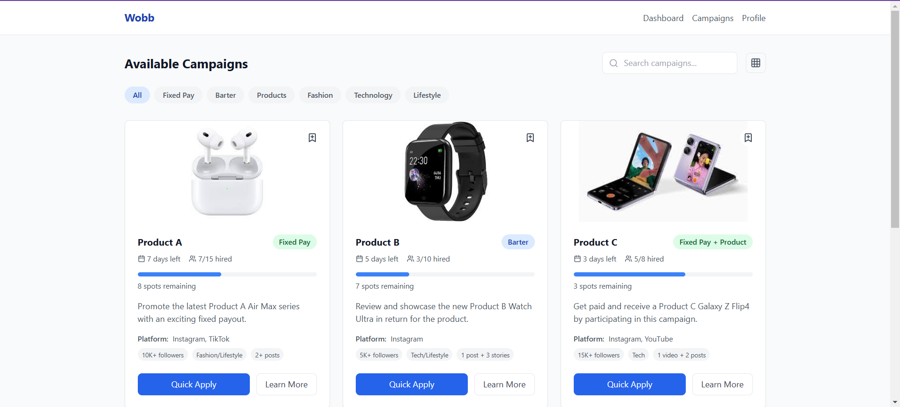

# Wobb Web App Design Documentation

## Preview

## Color Scheme

### Primary Colors

- **Blue (#2563EB)**: Used for primary actions, brand identity, and key interactive elements
  - Provides a professional, trustworthy feel
  - Different shades used for hover states and backgrounds
  - Light blue (#EFF6FF) used for selected filters and status indicators

### Secondary Colors

- **Green (#22C55E)**: Used for Fixed Pay indicators and success states
  - Indicates monetary value and positive actions
  - Light green (#DCFCE7) used for status backgrounds

### Neutral Colors

- **White (#FFFFFF)**: Primary background for cards and content areas
- **Gray (#F9FAFB)**: Page background and subtle separators
- **Dark Gray (#111827)**: Primary text color
- **Medium Gray (#6B7280)**: Secondary text and icons
- **Light Gray (#F3F4F6)**: Backgrounds for inactive states and filters

### Rationale

- The color scheme is designed to be clean and professional while maintaining good contrast for accessibility
- Blue as the primary color aligns with Wobb's brand identity and creates trust
- Clear distinction between interactive and static elements through consistent color usage
- Status-specific colors (green for fixed pay, blue for barter) help users quickly scan and identify campaign types

## Typography

### Font Hierarchy

1. **Headings**

   - Font: System UI (native font stack)
   - Sizes:
     - H1: 24px (1.5rem)
     - H2: 20px (1.25rem)
     - H3: 18px (1.125rem)
   - Weight: Bold (700)

2. **Body Text**

   - Font: System UI (native font stack)
   - Size: 16px (1rem)
   - Weight: Regular (400)

3. **Supporting Text**

   - Size: 14px (0.875rem)
   - Weight: Regular (400) or Medium (500)
   - Color: #6B7280 (gray-600)

4. **Labels & Tags**
   - Size: 12px (0.75rem)
   - Weight: Medium (500)

### Rationale

- System fonts chosen for optimal performance and native feel
- Clear size hierarchy helps users scan and understand content structure
- Consistent font weights establish visual hierarchy
- Larger text for important information (brand names, payout amounts)
- Smaller text for supporting details maintains a clean layout

## Spacing System

### Base Units

- Base unit: 4px (0.25rem)
- Common spacing values:
  - 4px (0.25rem): Minimal spacing
  - 8px (0.5rem): Tight spacing
  - 16px (1rem): Standard spacing
  - 24px (1.5rem): Section spacing
  - 32px (2rem): Large spacing

### Layout Spacing

1. **Container**

   - Max width: 1280px
   - Horizontal padding: 16px (mobile), 24px (tablet), 32px (desktop)

2. **Card Spacing**

   - Internal padding: 24px
   - Gap between cards: 24px
   - Section margins: 32px

3. **Element Spacing**
   - Between related elements: 8px
   - Between sections: 24px
   - Button padding: 8px 16px

### Grid System

- Responsive grid with dynamic columns:
  - Mobile: 1 column
  - Tablet: 2 columns
  - Desktop: 3 columns
- Gap between grid items: 24px

### Rationale

- Consistent spacing increments create visual rhythm
- Generous whitespace improves readability and reduces cognitive load
- Responsive spacing adapts to different screen sizes
- Hierarchical spacing helps group related elements
- Grid system provides optimal content density for different devices

## Component Design

### Cards

- Subtle shadow for depth (2px blur, low opacity)
- Rounded corners (8px) for a modern feel
- Consistent internal spacing
- Clear visual hierarchy of information

### Buttons

- Primary: Solid blue background
- Secondary: Border with transparent background
- Rounded corners (6px)
- Clear hover states
- Consistent padding (8px 16px)

### Interactive Elements

- Hover states for all clickable elements
- Focus states for accessibility
- Transition animations (0.2s) for smooth interactions

### Progress Bars

- Height: 8px
- Rounded corners
- Color indicates status
- Clear visual feedback

## Responsive Design

### Breakpoints

- Mobile: 0-639px
- Tablet: 640px-1023px
- Desktop: 1024px+

### Adaptation Strategy

- Single-column layout on mobile
- Fluid typography
- Stackable components
- Flexible grid system
- Responsive spacing
- Adaptive navigation
